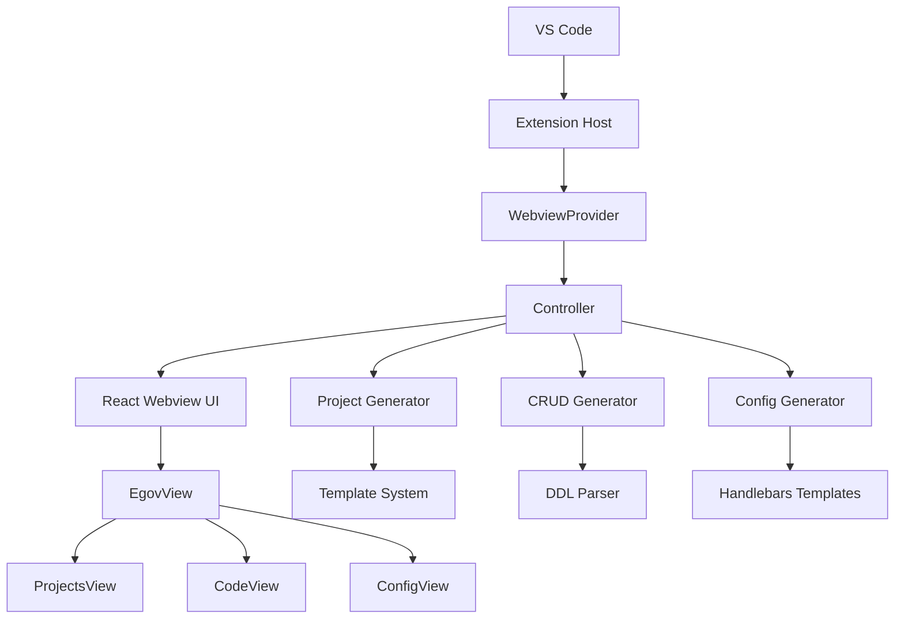

# eGovFrame VSCode Initializr

## 프로젝트 개요

**eGovFrame VSCode Initializr**는 전자정부 표준프레임워크(eGovFrame) 프로젝트 생성 및 설정을 위한 Visual Studio Code 확장 프로그램입니다. 개발자가 eGovFrame 기반 프로젝트를 쉽고 빠르게 시작할 수 있도록 도와주는 통합 도구입니다.

**컨트리뷰션 참여에 앞서 [컨트리뷰션 참여 방법 목차](#컨트리뷰션-참여-방법)를 반드시 확인 부탁드립니다.**

### 주요 기능

- **프로젝트 생성 기능**: eGovFrame 템플릿 기반 프로젝트 자동 생성
- **CRUD 코드 생성 기능**: DDL 기반 CRUD 코드 자동 생성
  - **실시간 미리보기**: DDL 변경시 템플릿 미리보기 자동 업데이트 (11개 템플릿 지원)
  - **성능 최적화**: 병렬 렌더링 및 지연 로딩으로 빠른 응답성
- **설정 코드 생성 기능**: Spring Framework 설정 파일 (XML, Java Config, YAML, Properties) 생성
- **VSCode 네이티브 UI**: VSCode 테마 통합 커스텀 React 컴포넌트 기반 사용자 인터페이스
- **다크/라이트 테마**: VSCode 테마 자동 연동 및 실시간 전환 지원

## 아키텍처 구조

```
┌──────────────────────────────────────────────────────────────────────────┐
│                            VS Code Extension                             │
├──────────────────────────────────────────────────────────────────────────┤
│  Extension Host (Node.js)          │  Webview UI (React)                 │
│  ├── extension.ts                  │  ├── App.tsx                        │
│  ├── core/                         │  ├── components/                    │
│  │   ├── webview/                  │  │   ├── egov/                      │
│  │   └── controller/               │  │   │   ├── tabs/                  │
│  ├── utils/                        │  │   │   │   ├── ProjectView.tsx    │
│  │   ├── projectGenerator.ts       │  │   │   │   ├── CodeView.tsx       │
│  │   ├── codeGenerator.ts          │  │   │   │   └── ConfigView.tsx     │
│  │   ├── configGenerator.ts        │  │   │   ├── forms/                 │
│  │   └── ...                       │  │   │   ├── CodePreview.tsx        │
│  ├── shared/                       │  │   │   ├── EgovSettingsView.tsx   │
│  │   ├── dataTypes.ts              │  │   │   ├── EgovView.tsx           │
│  │   ├── ExtensionMessage.ts       │  │   ├── ui/                        │
│  │   ├── WebviewMessage.ts         │  ├── context/                       │
│  │   └── ...                       │  ├── shared/                        │
│  └── services/                     │  └── utils/                         │
└──────────────────────────────────────────────────────────────────────────┘
```

### 컴포넌트 상호작용



## 폴더 구조

### 루트 구조
```
egovframe-vscode-initializr/
├── assets/              # 아이콘 및 리소스
├── src/                 # Extension 소스코드
├── webview-ui/          # React 웹뷰 UI
├── templates/           # 새로운 템플릿 루트 디렉토리
│   ├── projects/        # 프로젝트 템플릿
│   │   ├── examples/    # ZIP 템플릿 파일들 (Git LFS 관리)
│   │   └── pom/         # Maven POM 템플릿들
│   ├── config/          # Spring 설정 템플릿
│   └── code/            # CRUD 코드 템플릿
├── package.json         # Extension 메니페스트
├── esbuild.js           # Extension 빌드 설정
├── .gitattributes       # Git LFS 설정 파일
└── README.md            # 프로젝트 문서
```

> [!Important]
> **Git LFS 관리 파일**: `"*.zip"` 파일들은 모두 Git LFS로 관리됩니다. `"*.zip"` 파일들은 모두 `templates/projects/examples/` 폴더에만 존재합니다. 프로젝트 클론 전이라면 `git lfs install` 명령어를 실행 후 클론을 하면 됩니다. 프로젝트 클론을 먼저 했다면 `git lfs pull` 명령어로 다운로드하세요.

### Extension 소스 (`src/`)

```
src/
├── extension.ts                # Extension 진입점
├── core/
│   ├── webview/                # 웹뷰 라이프사이클 관리
│   │   └── index.ts            # WebviewProvider 클래스
│   └── controller/             # 웹뷰 메시지 처리 및 작업 관리
│       └── index.ts            # Controller 클래스
├── utils/                      # 핵심 생성 유틸리티
│   ├── projectGenerator.ts     # eGovFrame 프로젝트 생성
│   ├── codeGenerator.ts        # CRUD 코드 생성
│   ├── configGenerator.ts      # 설정 파일 생성
│   ├── ddlParser.ts            # DDL 파싱
│   ├── previewGenerator.ts     # 코드 미리보기 생성
│   └── codeGeneratorUtils.ts   # 공통 코드 생성 유틸
├── services/                   # 보조 서비스
│   └── glob/
│       └── list-files.ts       # 파일 목록 서비스
└── shared/                     # 공유 타입 및 유틸리티
    ├── api.ts
    ├── ExtensionMessage.ts
    └── WebviewMessage.ts
```

### Templates 디렉토리 (`templates/`)

```
templates/
├── templates-projects.json      # 프로젝트 템플릿 메타데이터
├── templates-context-xml.json   # 설정 템플릿 메타데이터
├── projects/                    # 프로젝트 템플릿
│   ├── examples/                # ZIP 템플릿 파일들
│   │   ├── egovframe-ai-rag-redis-stack.zip
│   │   ├── egovframe-boot-batch-db-commandline.zip
│   │   ├── egovframe-boot-simple-backend.zip
│   │   ├── egovframe-mobile-common-components.zip
│   │   ├── egovframe-msa-common-components.zip
│   │   ├── egovframe-template-common-components.zip
│   │   └── ... (총 21개 템플릿)
│   └── pom/                     # Maven POM 템플릿들
│       ├── egovframe-template-simple-pom.xml
│       ├── egovframe-boot-web-pom.xml
│       ├── egovframe-boot-simple-backend-pom.xml
│       └── ... (총 17개 POM 템플릿)
├── config/                      # Spring 설정 템플릿
│   ├── datasource/              # 데이터소스 설정
│   │   ├── datasource.hbs
│   │   ├── datasource-java.hbs
│   │   ├── jndiDatasource.hbs
│   │   └── jndiDatasource-java.hbs
│   ├── logging/                 # 로깅 설정 (21개 템플릿)
│   │   ├── console.hbs
│   │   ├── console-java.hbs
│   │   ├── console-yaml.hbs
│   │   ├── console-properties.hbs
│   │   ├── file.hbs
│   │   ├── rollingFile.hbs
│   │   └── ... (다양한 로깅 appender 템플릿)
│   ├── scheduling/              # 스케줄링 설정 (10개 템플릿)
│   │   ├── scheduler.hbs
│   │   ├── beanJob.hbs
│   │   ├── cronTrigger.hbs
│   │   └── simpleTrigger.hbs
│   ├── transaction/             # 트랜잭션 설정 (6개 템플릿)
│   │   ├── datasource.hbs
│   │   ├── jpa.hbs
│   │   └── jta.hbs
│   ├── idGeneration/            # ID 생성 설정 (6개 템플릿)
│   │   ├── xml-id-gnr-sequence-service.hbs
│   │   ├── xml-id-gnr-table-service.hbs
│   │   └── xml-id-gnr-uuid-service.hbs
│   └── property/                # 프로퍼티 설정 (2개 템플릿)
│       ├── property.hbs
│       └── property-java.hbs
└── code/                        # CRUD 코드 템플릿 (11개)
    ├── sample-controller-template.hbs
    ├── sample-service-template.hbs
    ├── sample-service-impl-template.hbs
    ├── sample-vo-template.hbs
    ├── sample-default-vo-template.hbs
    ├── sample-mapper-template.hbs
    ├── sample-mapper-interface-template.hbs
    ├── sample-jsp-list.hbs
    ├── sample-jsp-register.hbs
    ├── sample-thymeleaf-list.hbs
    └── sample-thymeleaf-register.hbs
```

> [!Note]
> **CRUD Code 템플릿 메타데이터**: CRUD Code 템플릿 메타데이터는 `src/utils/codeGenerator.ts`에 getTemplateFilesConfig 함수에서 관리됩니다.


### Webview UI (`webview-ui/`)

```
webview-ui/
├── package.json             # React 앱 의존성
├── vite.config.ts           # Vite 빌드 설정
├── tailwind.config.js       # TailwindCSS 설정 (VSCode 테마 통합)
└── src/
    ├── App.tsx              # 메인 React 앱
    ├── main.tsx             # React 진입점
    ├── components/
    │   ├── ui/                      # 커스텀 UI 컴포넌트 라이브러리
    │   │   ├── Button.tsx                # VSCode 스타일 버튼
    │   │   ├── Checkbox.tsx              # VSCode 스타일 체크박스
    │   │   ├── Divider.tsx               # VSCode 스타일 구분선
    │   │   ├── index.ts                  # 컴포넌트 라이브러리 엔트리포인트
    │   │   ├── Link.tsx                  # VSCode 스타일 링크
    │   │   ├── ProgressRing.tsx          # VSCode 스타일 프로그레스
    │   │   ├── RadioGroup.tsx            # VSCode 스타일 라디오 그룹
    │   │   ├── ResponsiveMenuButton.tsx  # VSCode 스타일 반응형 메뉴 버튼
    │   │   ├── Select.tsx                # VSCode 스타일 드롭다운
    │   │   ├── TextArea.tsx              # VSCode 스타일 텍스트 영역
    │   │   ├── TextField.tsx             # VSCode 스타일 입력 필드
    │   │   ├── theme.tsx                 # VSCode 스타일 테마 CSS 값
    │   │   └── VSCodeThemeProvider.tsx   # VSCode 테마 컨텍스트
    │   ├── egov/
    │   │   ├── EgovView.tsx         # 메인 탭 인터페이스
    │   │   ├── tabs/
    │   │   │   ├── ProjectsView.tsx  # 프로젝트 생성 탭
    │   │   │   ├── CodeView.tsx      # 코드 생성 탭 (네이티브 textarea)
    │   │   │   └── ConfigView.tsx    # 설정 생성 탭 (네이티브 select)
    │   │   ├── forms/               # 다양한 설정 폼들 (커스텀 컴포넌트 사용)
    │   │   │   ├── DatasourceForm.tsx
    │   │   │   ├── CacheForm.tsx
    │   │   │   ├── LoggingForm.tsx
    │   │   │   ├── TransactionForm.tsx
    │   │   │   ├── SchedulingForm.tsx
    │   │   │   └── ...
    │   │   ├── types/               # types 설정 인터페이스
    │   │   │   └── templates.ts     # ConfigFormData 인터페이스
    │   │   ├── CodePreview.tsx      # 코드 생성 탭 내 프리뷰 화면
    │   │   └── EgovSettingsView.tsx # Extension 설정 화면
    ├── context/
    │   ├── EgovTabsStateContext.tsx # egov 탭 상태 관리
    │   └── ExtensionStateContext.tsx # Extension 전반 상태 관리
    └── utils/
        ├── templateUtils.ts
        ├── ddlParser.ts
        ├── cn.ts                    # 클래스 네임 유틸리티
        ├── egovUtils.ts
        └── ...
```

## UI 컴포넌트 시스템

### VSCode 테마 통합 아키텍처

프로젝트는 VSCode의 네이티브 디자인 시스템과 완전히 통합된 커스텀 React 컴포넌트 라이브러리를 구축했습니다.

#### 핵심 설계 원칙
- **네이티브 VSCode 스타일**: 모든 UI 컴포넌트가 VSCode 기본 테마와 일관성 유지
- **다크/라이트 테마 지원**: VSCode CSS 변수를 활용한 자동 테마 전환
- **타입 안전성**: 완전한 TypeScript 지원

#### 커스텀 UI 컴포넌트 라이브러리

| 컴포넌트 | 설명 | VSCode 테마 변수 |
|----------|------|------------------|
| **Button** | Primary, Secondary, Ghost 버튼 | `--vscode-button-*` |
| **TextField** | 텍스트 입력 필드 | `--vscode-input-*` |
| **TextArea** | 멀티라인 텍스트 입력 | `--vscode-input-*` |
| **Select** | 드롭다운 선택 박스 | `--vscode-input-*` |
| **RadioGroup** | 라디오 버튼 그룹 | `--vscode-checkbox-*` |
| **Checkbox** | 체크박스 입력 | `--vscode-checkbox-*` |
| **ProgressRing** | 로딩 인디케이터 | `--vscode-progressBar-*` |
| **Link** | 링크 컴포넌트 | `--vscode-textLink-*` |
| **Divider** | 구분선 | `--vscode-panel-border` |

#### VSCode 테마 변수 활용
```typescript
// 예시: Button 컴포넌트의 테마 스타일
const getButtonStyles = (variant: 'primary' | 'secondary') => ({
  backgroundColor: variant === 'primary'
    ? 'var(--vscode-button-background)'
    : 'var(--vscode-button-secondaryBackground)',
  color: variant === 'primary'
    ? 'var(--vscode-button-foreground)'
    : 'var(--vscode-button-secondaryForeground)',
  border: '1px solid var(--vscode-button-border)',
  // 호버 효과
  '&:hover': {
    backgroundColor: variant === 'primary'
      ? 'var(--vscode-button-hoverBackground)'
      : 'var(--vscode-button-secondaryHoverBackground)'
  }
})
```

#### 테마 시스템 구조
```typescript
// VSCode 테마 컨텍스트
interface VSCodeTheme {
  colors: {
    // 배경색
    background: string
    inputBackground: string
    buttonBackground: string

    // 전경색
    foreground: string
    inputForeground: string
    buttonForeground: string

    // 테두리
    inputBorder: string
    focusBorder: string
  }
  spacing: { xs: string, sm: string, md: string, lg: string }
  borderRadius: { sm: string, md: string, lg: string }
  fontSize: { xs: string, sm: string, md: string, lg: string }
}
```

#### 네이티브 HTML 엘리먼트 활용
성능 최적화와 브라우저 호환성을 위해 핵심 입력 컴포넌트들은 네이티브 HTML 엘리먼트를 직접 사용:

- **CodeView DDL TextArea**: `<textarea>` + VSCode 테마 인라인 스타일
- **Select 박스들**: `<select>` + `appearance: none` + VSCode 테마 스타일
- **모든 버튼들**: `<button>` + 동적 이벤트 핸들러

#### Monaco Editor 활용

**DDL 입력 및 코드 미리보기**에서 Monaco Editor를 사용하여 고급 편집 기능을 제공합니다.

##### 주요 기능
- **SQL 문법 강조 (Syntax Highlighting)**:
  - `monaco-sql-languages` 라이브러리를 통한 MySQL/PostgreSQL DDL 문법 강조
  - `monaco-sql-languages` 라이브러리를 통한 실시간 SQL 문법 검증 및 오류 표시
  - `monaco-sql-languages` 라이브러리를 통한 자동 완성 및 인텔리센스 지원

- **멀티 SQL 방언 지원**:
  - MySQL과 PostgreSQL DDL 문법 전환 지원
  - 각 방언별 전용 Language Worker 사용
  - 동적 언어 모드 전환

- **실시간 DDL 검증**:
  - Monaco Editor의 마커(Marker) API를 통한 실시간 오류 감지
  - 500ms 디바운스로 최적화된 검증 성능
  - Worker 기반 백그라운드 검증으로 UI 블로킹 방지

- **코드 미리보기**:
  - 생성될 코드를 Monaco Editor로 표시
  - Java, XML, JSP, HTML 등 언어별 문법 강조
  - 읽기 전용 모드로 안전한 미리보기 제공

##### 기술 구현
```typescript
// Monaco Editor 설정
import Editor, { loader } from "@monaco-editor/react"
import * as monaco from "monaco-editor"
import "monaco-sql-languages/esm/languages/mysql/mysql.contribution"
import "monaco-sql-languages/esm/languages/pgsql/pgsql.contribution"

// Worker를 Vite를 이용해 inline으로 Import
import MySQLWorker from "monaco-sql-languages/esm/languages/mysql/mysql.worker?worker&inline"
import PgSQLWorker from "monaco-sql-languages/esm/languages/pgsql/pgsql.worker?worker&inline"
import EditorWorker from "monaco-editor/esm/vs/editor/editor.worker?worker&inline"

// 커스텀한 Monaco 설정을 등록 (@monaco-editor/react가 monaco 설정을 CDN으로 로드하여 커스텀한 Monaco 설정이 등록되지 않는 문제 방지)
loader.config({ monaco })

// Worker 설정 (Vite inline 번들링으로 CORS 문제 해결)
window.MonacoEnvironment = {
  getWorker(_: any, label: string) {
    if (label === "mysql") return new MySQLWorker()
    if (label === "pgsql") return new PgSQLWorker()
    return new EditorWorker()
  }
}

// 실시간 검증: 모델 내용이 변경될 때마다 디바운스 후 검증 (테이블 이름 변경 등 모든 변경사항 감지)
editor.onDidChangeModelContent()
// 실시간 검증: 언어 변경 시 즉시 재검증 (SQL 방언 변경: MySQL ↔ PostgreSQL)
editor.onDidChangeModelLanguage()
// 실시간 검증: Monaco Worker가 마커(에러 내용)를 업데이트할 때마다 즉시 검증
monacoInstance.editor.onDidChangeMarkers()
```

##### 성능 최적화
- **Worker 번들링**: Vite의 `?worker&inline` 플래그로 Worker를 base64 인라인 번들링
- **CORS 문제 해결**: VSCode Webview 환경에서 외부 Worker 로딩 문제 해결
- **지연 검증**: 입력 후 500ms 디바운스로 불필요한 검증 방지
- **백그라운드 처리**: Web Worker를 통한 비동기 문법 분석

## 주요 기능별 상세 설명

### 1. 프로젝트 생성 (Projects)

#### 기능 개요
- eGovFrame 표준 템플릿 기반 프로젝트 자동 생성
- Maven/Gradle 프로젝트 구조 지원
- 다양한 카테고리별 템플릿 제공

### 2. 코드 생성 (CodeView)

#### 기능 개요
- DDL 기반 CRUD 코드 자동 생성
- 11개 템플릿 타입 지원 (VO, DefaultVO, Service, ServiceImpl, Controller, Mapper, Mapper Interface, JSP, Thymeleaf 등)
- 실시간 DDL 검증 및 파싱

#### 미리보기 기능
- 생성될 코드를 미리 확인

##### 주요 특징
- **DDL 문법 검증**: `monaco-sql-languages` 라이브러리를 통한 실시간 SQL 문법 검증 및 오류 표시
- **11개 템플릿 미리보기**: VO, DefaultVO, Controller, Service, ServiceImpl, Mapper, Mapper Interface, JSP List/Register, Thymeleaf List/Register
- **미리보기 선택적 자동 업데이트**: 사용자가 원할 때만 자동 미리보기 생성
- **병렬 렌더링**: 11개 템플릿을 동시에 처리하여 빠른 미리보기 생성
- **Handlebars 바인딩**: 실제 데이터가 바인딩된 완성된 코드 미리보기

##### 사용 방법
1. **DDL 입력**: MySQL/PostgreSQL DDL 문법으로 테이블 정의
2. **빠른 검증**: 500ms 디바운스로 DDL 유효성 검사 완료
3. **미리보기 생성**: "미리보기 생성" 버튼 클릭
4. **템플릿 선택**: 드롭다운에서 원하는 템플릿 선택
5. **코드 확인**: 실제 바인딩된 코드 미리보기
6. **자동 업데이트**: 체크박스로 DDL 변경시 자동 미리보기 업데이트 설정

##### 성능 최적화
- **지연 로딩**: 필요시에만 미리보기 생성 (기본 동작)
- **병렬 처리**: Promise.all()을 사용한 11개 템플릿 동시 렌더링
- **디바운싱**: 500ms 디바운스로 불필요한 요청 방지
- **캐시 무효화**: DDL 변경시 기존 미리보기 자동 초기화

##### 지원 템플릿 목록
| 템플릿 | 설명 | 파일 확장자 |
|--------|------|-------------|
| **VO** | Value Object 클래스 | `.java` |
| **DefaultVO** | 기본 VO 클래스 | `.java` |
| **Controller** | Spring MVC 컨트롤러 | `.java` |
| **Service** | 서비스 인터페이스 | `.java` |
| **ServiceImpl** | 서비스 구현체 | `.java` |
| **Mapper** | MyBatis XML 매퍼 | `.xml` |
| **Mapper Interface** | MyBatis 인터페이스 | `.java` |
| **JSP List** | 목록 페이지 | `.jsp` |
| **JSP Register** | 등록/수정 페이지 | `.jsp` |
| **Thymeleaf List** | 목록 페이지 | `.html` |
| **Thymeleaf Register** | 등록/수정 페이지 | `.html` |

## 🔧 빌드 시스템

### Extension 빌드 (ESBuild)

**설정 파일**: `esbuild.js`

#### 주요 특징
- **번들링**: 모든 소스를 단일 `dist/extension.js` 파일로 번들
- **타입스크립트 컴파일**: 네이티브 TS 지원
- **경로 별칭**: `@core`, `@utils`, `@shared` 등 단축 경로
- **감시 모드**: 개발 중 자동 리빌드
- **WASM 파일 복사**: Tree-sitter 언어 파서용

#### 빌드 명령어
```bash
# 개발 빌드 + 감시
npm run watch

# 프로덕션 빌드
npm run package

# 타입 체크
npm run check-types

# 린팅
npm run lint
```

### Webview UI 빌드 (Vite)

**설정 파일**: `webview-ui/vite.config.ts`

#### 주요 특징
- **React + SWC**: 빠른 개발 서버 및 빌드
- **TailwindCSS + VSCode 테마**: 유틸리티 우선 CSS + VSCode 네이티브 스타일
- **커스텀 UI 라이브러리**: VSCode 테마 통합 React 컴포넌트
- **HMR**: Hot Module Replacement로 빠른 개발
- **타입스크립트**: 완전한 타입 안정성 (UI 컴포넌트 포함)
- **테스트**: Vitest + JSdom 환경

#### 빌드 명령어
```bash
# 개발 서버 시작
cd webview-ui && npm run dev

# 프로덕션 빌드
cd webview-ui && npm run build

# 테스트 실행
cd webview-ui && npm run test

# 테스트 커버리지
cd webview-ui && npm run test:coverage
```

## 사용 예시

### 미리보기 기능 사용하기

#### 1. DDL 입력 및 검증
```sql
CREATE TABLE users (
  id INT PRIMARY KEY AUTO_INCREMENT,
  name VARCHAR(100) NOT NULL,
  email VARCHAR(100) UNIQUE NOT NULL,
  created_at TIMESTAMP DEFAULT CURRENT_TIMESTAMP
);
```

#### 2. 미리보기 생성
1. DDL 입력 후 500ms 디바운스로 유효성 검사 완료
2. "미리보기 생성" 버튼 클릭
3. 드롭다운에서 원하는 템플릿 선택 (예: VO, Controller, Service 등)
4. 실제 바인딩된 코드 미리보기 확인

#### 3. 자동 업데이트 설정
- "DDL 변경시 자동으로 미리보기 업데이트" 체크박스 활성화
- DDL 수정시 자동으로 미리보기 업데이트

#### 4. 코드 생성
- 미리보기 확인 후 "Generate Code" 버튼 클릭
- 선택된 출력 경로(프로젝트)에 미리 정의된 디렉터리 구조에 맞춰 CRUD 파일 생성

## 개발 워크플로우

이 목차는 [컨트리뷰션 참여 방법 목차에서 "4. 작업"](#4-작업)에 해당하는 내용입니다. 작업 전 후 과정은 [컨트리뷰션 참여 방법](#컨트리뷰션-참여-방법)을 참고 부탁드립니다.

### 1. git lfs 설치

`templates/projects/examples/` 안에 `"*.zip"` 파일들은 모두 git lfs로 관리되고 있습니다. 먼저 git lfs를 설치합니다.

```git
git lfs install
```

### 2. 전체 의존성 설치

프로젝트의 의존성은 백엔드에 해당하는 `./package.json`과 프론트엔드에 해당하는 `./webview-ui/package.json`이 있습니다. 양 쪽 모두의 의존성을 설치합니다.

```bash
# 전체 의존성 설치
cd path/to/repo
npm run install:all
```

### 3. Git Hooks 설정 (자동 코드 형식 맞춤)
프로젝트는 커밋하기 전에 자동으로 코드 형식을 맞추는 Git hooks가 설정되어 있습니다.

#### 설정된 기능
- **husky**: Git hooks 관리
- **lint-staged**: 스테이징된 파일들에만 특정 작업 실행
- **pre-commit hook**: 커밋 전 자동 코드 형식 맞춤

#### 작동 방식
`git commit` 실행 시 자동으로:
1. **JavaScript/TypeScript 파일들**: `prettier --write` + `eslint --fix`
2. **JSON, MD, YAML 파일들**: `prettier --write`
3. 수정된 파일들이 자동으로 스테이징되고 커밋됨

#### 기본 사용법
```bash
# 평소처럼 개발 후
git add .
git commit -m "커밋 메시지"
# → 자동으로 코드 형식이 맞춰지고 커밋됨
```

#### 수동 실행
```bash
# 전체 프로젝트 코드 형식 맞춤
npm run format:fix

# 린팅 오류 수정
npm run lint
```

### 4. 개발 모드 실행
```bash
# Terminal 1: Extension 감시 빌드
npm run watch

# Terminal 2: Webview UI 개발 서버
npm run dev:webview
```

### 5. 디버깅 설정
VS Code에서 F5 키를 눌러 Extension Development Host 실행

**`.vscode/launch.json`** 설정이 필요한 경우:
```json
{
    "version": "0.2.0",
    "configurations": [
        {
            "name": "Run Extension",
            "type": "extensionHost",
            "request": "launch",
            "args": ["--extensionDevelopmentPath=${workspaceFolder}"],
            "outFiles": ["${workspaceFolder}/dist/**/*.js"],
            "preLaunchTask": "${workspaceFolder}/npm: compile"
        }
    ]
}
```

### 6. 테스트 실행
```bash
# Extension 테스트 (향후 추가 예정)
npm test

# Webview UI 테스트
cd webview-ui && npm run test
```

### 7. 코드 품질 검사
```bash
npm run lint
npm run format:fix
npm run check-types
```

## 배포 및 퍼블리싱

### 1. Extension 패키징
```bash
# VSIX 파일 생성
npm run package # script : npm run check-types && npm run build:webview && npm run lint && node esbuild.js --production

#vscode 패키지를 전역 설치한 경우
vsce package
#vscode 패키지를 프로젝트 로컬에만 설치한 경우
npx vsce package

# 생성된 파일: egovframe-initializr-{version}.vsix
```

### 2. 마켓플레이스에 배포 및 퍼블리싱
VSCode의 [Publishing Extensions 문서](https://code.visualstudio.com/api/working-with-extensions/publishing-extension)를 참고하시기 바랍니다.

### 3. 배포 전 체크리스트
- [ ] 모든 테스트 통과
- [ ] 린팅 오류 없음
- [ ] `package.json` 버전 업데이트
- [ ] `CHANGELOG.md` 작성
- [ ] 프로덕션 빌드 테스트
- [ ] Extension Host에서 수동 테스트

## 기술 스택

### Backend (Extension Host)
- **런타임**: Node.js
- **언어**: TypeScript 5.4+
- **빌드**: ESBuild 0.25+
- **템플릿 엔진**: Handlebars 4.7+
- **파일 처리**:
  - fs-extra 11.2+ (파일 시스템 유틸리티)
  - extract-zip 2.0+ (ZIP 압축 해제)
  - archiver 7.0+ (파일 압축)
  - globby 14.1+ (파일 패턴 매칭)

### Frontend (Webview UI)
- **프레임워크**: React 18.3+
- **언어**: TypeScript 5.7+
- **빌드**: Vite 6.3+ + SWC
- **스타일링**:
  - TailwindCSS 4.1+ (유틸리티 우선 CSS)
  - VSCode CSS 변수 통합 (테마 시스템)
- **코드 에디터**:
  - Monaco Editor 0.31+ (코어)
  - @monaco-editor/react 4.7+ (React 래퍼)
  - monaco-sql-languages 0.15+ (MySQL/PostgreSQL 언어 지원)
- **UI 컴포넌트**:
  - 커스텀 React 컴포넌트 (VSCode 네이티브 스타일)
  - lucide-react 0.511+ (아이콘)
  - clsx 2.1+ (조건부 클래스명 유틸리티)
- **상태 관리**: React Context API + 커스텀 훅
- **폼 처리**: 네이티브 HTML 폼 + React 상태 관리
- **테스트**: Vitest 3.0+ + Testing Library + JSdom

### 개발 도구
- **린터**: ESLint 8.57+ + TypeScript ESLint 8.18+
- **포매터**: Prettier 3.3+
- **타입 체킹**: TypeScript (strict mode)
- **Git Hooks**: Husky 9.1+ + lint-staged 16.1+
- **패키징**: @vscode/vsce 3.6+

## 트러블슈팅

### 일반적인 문제들

#### 1. Extension이 활성화되지 않는 경우
```bash
# 빌드 상태 확인
npm run check-types
npm run compile

# VS Code 개발자 도구에서 오류 확인
Ctrl+Shift+I (또는 Cmd+Option+I)
```

#### 2. Webview가 로드되지 않는 경우
```bash
# Webview UI 빌드 확인
cd webview-ui
npm run build

# 개발 서버 포트 확인 (25463)
npm run dev
```

#### 3. 템플릿 생성 오류

##### 프로젝트 템플릿 생성 실패
- **ZIP 파일 문제**:
  - `templates/projects/examples/` 폴더의 ZIP 파일 존재 확인
  - Git LFS 설정 확인 (ZIP 파일이 포인터 파일이 아닌지 확인)
  - ZIP 파일 손상 여부 확인 (`unzip -t <파일명>`)
- **POM 파일 문제**:
  - `templates/projects/pom/` 폴더의 POM 템플릿 존재 확인
  - 선택한 템플릿에 맞는 POM 파일 존재 확인 (예: `egovframe-boot-web-pom.xml`)
- **출력 경로 문제**:
  - 프로젝트 생성 대상 디렉토리의 쓰기 권한 확인
  - 디스크 공간 부족 여부 확인
  - 경로에 특수문자나 한글이 포함되어 있는지 확인

##### CRUD 코드 템플릿 생성 실패
- **Handlebars 템플릿 문제**:
  - `templates/code/` 폴더의 11개 템플릿 파일 존재 확인
  - Handlebars 문법 오류 검토 (중괄호 매칭, 헬퍼 함수 등)
  - 템플릿 메타데이터: `src/utils/codeGenerator.ts`의 `getTemplateFilesConfig()` 함수 확인
- **DDL 파싱 문제**:
  - Monaco Editor의 SQL Worker가 정상 작동하는지 확인
  - `dist/tree-sitter-wasms.wasm`, `dist/tree-sitter-sql.wasm` 파일 존재 확인
  - DDL 문법이 MySQL/PostgreSQL 표준에 맞는지 확인
- **출력 경로 문제**:
  - 프로젝트 루트가 올바르게 선택되었는지 확인
  - `src/main/java/` 등 표준 Maven/Gradle 디렉토리 구조 확인
  - 패키지명이 유효한지 확인 (예: `egovframework.example.sample`)

##### 설정 템플릿 생성 실패
- **템플릿 파일 문제**:
  - `templates/config/` 폴더의 하위 디렉토리 확인 (datasource, cache, logging 등)
  - 선택한 설정 유형에 맞는 템플릿 파일 존재 확인
  - 템플릿 메타데이터: `templates/templates-context-xml.json` 파일 확인
- **Handlebars 컨텍스트 문제**:
  - 폼 입력값이 올바르게 전달되는지 확인
  - 필수 입력값 누락 여부 확인
  - 브라우저 개발자 도구의 Console에서 오류 확인

#### 4. 미리보기 기능 문제
- **미리보기가 표시되지 않는 경우**:
  - DDL 유효성 확인 (500ms 디바운스 후 즉시 검증 완료)
  - "미리보기 생성" 버튼 클릭
  - 브라우저 개발자 도구에서 오류 확인
- **미리보기가 업데이트되지 않는 경우**:
  - DDL 변경 후 자동 무효화 확인
  - 자동 업데이트 옵션 활성화 여부 확인
  - 수동으로 "미리보기 생성" 버튼 재클릭
- **미리보기 생성이 느린 경우**:
  - 11개 템플릿 병렬 렌더링 확인
  - 네트워크 상태 및 VSCode 성능 확인

### 로그 확인 방법
```bash
# Extension 로그
VS Code > View > Output(출력) > eGovFrame Initializr

# Webview 로그
VS Code > Help > Toggle Developer Tools > Console
```

### Git LFS 문제 해결

#### 큰 파일 다운로드 실패 시
```bash
# Git LFS 파일들 강제 다운로드
git lfs pull --include="*.zip"

# 특정 파일만 다운로드
git lfs pull --include="templates/projects/examples/*.zip"
```

#### Git LFS 추적 목록 확인
```bash
# LFS로 추적되는 파일 목록 확인
git lfs ls-files

# LFS 설정 확인
git lfs track
```

#### `git lfs install` 명령 실행 전에 clone 한 경우
```bash
# LFS 설정 초기화
git lfs uninstall
git lfs install

# LFS 파일들 다시 다운로드
git lfs pull
```

#### Git LFS 추적 파일들이 변경되거나 추가 시
```bash
# LFS로 추적되는 파일을 Reomte에 Push
git lfs push --all origin main

# 그 후 소스코드를 Remote에 Push 한다
git push origin main
```


## 성능 최적화

### Extension 최적화
- **지연 로딩**: `activationEvents`를 `onStartupFinished`로 설정
- **번들 크기**: ESBuild로 최소화된 번들 (~500KB)
- **메모리 관리**: Webview 인스턴스 적절한 해제
- **템플릿 처리**: Handlebars 템플릿 컴파일 최적화

### Webview UI 최적화
- **코드 분할**: Vite의 동적 import 활용
- **네이티브 HTML 엘리먼트**: 성능 최적화를 위해 textarea, select, button 직접 사용
- **VSCode CSS 변수**: 런타임 테마 전환 최적화
- **리소스 최적화**: 이미지 및 폰트 최적화
- **메모이제이션**: React.memo, useMemo, useCallback 활용
- **경량 UI 라이브러리**: Material-UI 등 제거로 번들 크기 최소화
- **Context 최적화**: 필요한 상태만 선택적으로 구독

### Monaco Editor 최적화
- **Worker 인라인 번들링**: Vite `?worker&inline`으로 CORS 문제 해결 및 로딩 속도 향상
- **지연 검증**: 입력 후 500ms 디바운스로 불필요한 검증 방지
- **백그라운드 파싱**: Web Worker를 통한 비동기 SQL 문법 분석
- **마커 기반 검증**: Monaco의 onDidChangeMarkers 이벤트로 효율적인 오류 감지
- **초기화 최적화**: Editor mount 시 100ms 지연으로 Worker 초기화 대기

### 미리보기 성능 최적화
**미리보기 기능의 성능 최적화 전략**

#### 병렬 렌더링
- `Promise.all()`을 사용하여 11개 템플릿을 병렬로 렌더링하여 11배 속도 향상

#### 지연 미리보기 (Lazy Preview)
- DDL 입력시 빠른 검증만 수행 (500ms 디바운스)
- DDL 입력시마다 모든 템플릿 미리보기 생성하는 대신(느림), 사용자가 "미리보기 생성" 버튼을 클릭할 때만 전체 미리보기 생성
- **목적**: 불필요한 리소스 사용 방지, 사용자 선택권 제공

#### 스마트 캐시 관리
- **DDL 변경 감지**: DDL이 변경되면 기존 미리보기 자동 무효화
- **선택적 자동 업데이트**: 사용자가 원할 때만 자동 미리보기 업데이트
- **디바운싱**: 500ms 디바운스로 불필요한 요청 방지
- **이벤트 최적화**: onDidChangeMarkers 등의 이벤트를 활용하여 불필요한 검증 배제

#### 성능 효과
| 작업 | 성능 최적화 적용 X | 성능 최적화 적용 O | 개선율 |
|------|------|------|--------|
| **DDL 검증** | 즉시 검증 (UI 블로킹) | 500ms 디바운스 (백그라운드) | **UI 반응성 향상** |
| **미리보기 생성** | 매번 자동 생성 | 필요시만 생성 | **선택적 생성** |
| **템플릿 렌더링** | 순차 처리 | 병렬 처리 (Promise.all) | **~11배 속도 향상** |
| **Worker 로딩** | 외부 파일 (CORS 문제) | 인라인 번들 (base64) | **로딩 안정성 향상** |

## 기여 가이드

### 컨트리뷰션 참여 방법

#### 1. Git LFS 설치(필수)

Git LFS 패키지를 설치합니다.

  -  **Windows**는 [Windows용 Git 배포판](https://gitforwindows.org/)에 Git LFS 패키지도 포함되어 있습니다. 설치 마법사에서 "Use Git from Windows Command Prompt" 옵션을 체크해야 합니다. 만약 Git LFS 패키지를 최신 버전으로 업그레이드 하기를 원한다면, Chocolatey 패키지 관리자를 사용할 수 있습니다.
  ```bash
  # Windows - Git LFS를 최신버전으로 설치하고 싶다면
  choco install git-lfs.install
  ```

  - **macOS**는 Homebrew를 이용해 Git LFS 패키지를 설치할 수 있습니다.
  ```bash
  # macOS - Homebrew(권장)
  brew install git-lfs
  ```

  - **Linux**는 packagecloud 레포지토리에서 제공하는 스크립트를 이용하여 설치합니다. 자세한 내용은 [Git LFS 레포지토리](https://github.com/git-lfs/git-lfs/blob/main/INSTALLING.md)에서 확인 가능합니다.
  ```bash
  # Ubuntu/Debian Linux
  curl -s https://packagecloud.io/install/repositories/github/git-lfs/script.deb.sh | sudo bash
  sudo apt-get install git-lfs

  # RPM 계열 Linux
  curl -s https://packagecloud.io/install/repositories/github/git-lfs/script.rpm.sh | sudo bash
  sudo yum install git-lfs
  ```

Git LFS 패키지를 설치한 후, Git LFS 전역설정을 추가합니다. Git LFS 패키지 설치 후 다음 명령어를 최초 1회만 실행하면 됩니다.

```bash
git lfs install
```

위 명령을 실행하면 `.gitconfig` 설정 파일에 다음과 같은 키들이 추가됩니다.
```
[filter "lfs"]
  filter.lfs.clean = git-lfs clean -- %f
  filter.lfs.smudge = git-lfs smudge -- %f
  filter.lfs.process = git-lfs filter-process
  filter.lfs.required = true
```

> [!Warning]
> 
> Git LFS와 관련한 Trouble Shooting은 ["Git LFS 문제 해결" 목차](#git-lfs-문제-해결)를 참고하기 바랍니다.

#### 2. Fork & Clone & Upstream

[Github Repository](https://github.com/eGovFramework/egovframe-vscode-initializr) 우측 상단에 "Fork" 버튼을 클릭하여 egovframe-vscode-initializr 레포지토리를 Fork합니다.

Fork하여 생성된 개인 레포지토리를 로컬에 Clone하여 소스를 받아옵니다.

```bash
git clone {Fork하여 생성된 개인 레포지토리의 URL}.git
```

> [!Warning]
> 
> Git LFS 패키지 설치와 전역설정에 문제가 없다면, `templates/projects/examples/` 디렉토리에 zip파일들의 size에 문제가 없어야 합니다.
>
> Git LFS에 문제가 있다면 해당 zip파일들은 단순 포인터로서 개별 size가 약 매우 작고 압축해제도 오류가 발생합니다. Git LFS와 관련한 Trouble Shooting은 ["Git LFS 문제 해결" 목차](#git-lfs-문제-해결)를 참고하기 바랍니다.

Upstream에 egovframe-vscode-initializr 레포지토리를 연결합니다.

```bash
cd path/to/repo

git remote add upstream https://github.com/eGovFramework/egovframe-vscode-initializr.git
```

#### 3. 작업 시작 전

```bash
# 작업 시작 전에 upstream인 egovframe-vscode-initializr 레포지토리의 main 브랜치와 싱크를 맞춥니다.
git fetch upstream main

# 내 로컬의 메인 브랜치(main)로 이동합니다.
git checkout main

# upstream과 병합합니다(또는 리베이스).
# - 병합
git merge upstream/main
# - (또는)리베이스
git rebase upstream/main

# 충돌 발생시 해결

# (선택) 기여자님의 origin 레포지토리에도 동기화
git push origin main

# 작업 브랜치(예: feat/something)로 이동하여 진행
git checkout -b feat/something

# 작업 진행
```

#### 4. 작업

워크플로우에 관한 내용은 ["개발 워크플로우" 목차](#-개발-워크플로우)를 참고하시기 바랍니다.

#### 5. 커밋 및 Push

```bash
# 변경사항을 스테이징한 후 커밋합니다.
git add .
git commit -m "{커밋 메시지}"

# push 하기 전에 upstream인 egovframe-vscode-initializr 레포지토리의 main 브랜치와 다시 한 번 싱크를 맞춥니다(충돌 방지 목적).
git fetch upstream main

# upstream과 병합합니다(또는 리베이스).
# - 병합
git merge upstream/main
# - (또는)리베이스
git rebase upstream/main

# 충돌 해결

# 충돌 해결사항을 스테이징합니다.
git add .

# 스테이징한 사항을 병합합니다(또는 리베이스).
# - 병합
git commit # 자동으로 커밋 메시지가 설정됨
# - (또는) 리베이스
git rebase --continue

# 기여자님의 origin 레포지토리에 push
git push origin main
```

#### 6. PR 생성

- Github에서 기여자님의 개인 레포지토리(egovframe-docs를 포크한 레포지토리) 페이지로 이동합니다.
- “Compare & pull request” 버튼을 클릭합니다.
- 제목과 설명 입력 후 “Create pull request” 버튼을 클릭합니다.

### 코딩 컨벤션
- **TypeScript**: strict 모드 사용
- **네이밍**: camelCase (변수, 함수), PascalCase (클래스, 인터페이스)
- **파일명**: kebab-case 권장
- **커밋 메시지**: Conventional Commits 규칙 준수

### 새로운 UI 컴포넌트 추가하기

1. **컴포넌트 파일 생성**
   ```tsx
   // webview-ui/src/components/ui/NewComponent.tsx
   import React from 'react'
   import { cn } from '../../utils/cn'
   import { useVSCodeTheme } from './VSCodeThemeProvider'

   export interface NewComponentProps extends React.HTMLAttributes<HTMLDivElement> {
     variant?: 'primary' | 'secondary'
     size?: 'sm' | 'md' | 'lg'
   }

   export const NewComponent: React.FC<NewComponentProps> = ({
     variant = 'primary',
     size = 'md',
     className,
     ...props
   }) => {
     const theme = useVSCodeTheme()

     return (
       <div
         className={cn('custom-component', className)}
         style={{
           backgroundColor: 'var(--vscode-input-background)',
           color: 'var(--vscode-input-foreground)',
           border: '1px solid var(--vscode-input-border)',
           // VSCode 테마 변수 활용
         }}
         {...props}
       />
     )
   }
   ```

2. **컴포넌트 라이브러리 등록**
   ```tsx
   // webview-ui/src/components/ui/index.ts
   export { NewComponent, type NewComponentProps } from './NewComponent'
   ```

3. **네이티브 HTML 엘리먼트 활용 (권장)**
   ```tsx
   // 성능 최적화를 위해 네이티브 엘리먼트 직접 사용
   <input
     style={{
       backgroundColor: 'var(--vscode-input-background)',
       color: 'var(--vscode-input-foreground)',
       border: '1px solid var(--vscode-input-border)',
       appearance: 'none',
       WebkitAppearance: 'none',
       MozAppearance: 'none',
     }}
     onFocus={(e) => {
       (e.target as HTMLInputElement).style.borderColor = 'var(--vscode-focusBorder)'
     }}
   />
   ```

### 새로운 템플릿 추가하기

1. **템플릿 파일 생성**
   ```
   templates/config/{category}/{template}.hbs
   ```

2. **메타데이터 추가**
   ```json
   // templates/templates-context-xml.json
   {
       "displayName": "Category > New Template",
       "templateFolder": "category",
       "templateFile": "template.hbs",
       "webView": "category-template-form.tsx",
       "fileNameProperty": "txtFileName",
       "javaConfigTemplate": "template-java.hbs",
       "yamlTemplate": "template-yaml.hbs",
       "propertiesTemplate": "template-properties.hbs"
   }
   ```

3. **폼 컴포넌트 생성 (커스텀 UI 컴포넌트 사용)**
   ```tsx
   // webview-ui/src/components/egov/forms/CategoryTemplateForm.tsx
   import { Button, TextField, Select, RadioGroup } from "../../ui"

   const CategoryTemplateForm: React.FC<FormProps> = ({ onSubmit }) => {
     return (
       <form onSubmit={onSubmit}>
         <TextField label="Template Name" />
         <Select options={[...]} />
         <RadioGroup options={[...]} />
         <Button variant="primary" type="submit">Generate</Button>
       </form>
     )
   }
   ```

## 참고 자료

### 공식 문서
- [VS Code Extension API](https://code.visualstudio.com/api)
- [eGovFrame 공식 사이트](https://www.egovframe.go.kr)
- [Spring Framework 문서](https://spring.io/docs)

### 기술 문서
- [React 공식 문서](https://react.dev)
- [TypeScript 문서](https://www.typescriptlang.org/docs/)
- [Vite 문서](https://vitejs.dev)
- [TailwindCSS 문서](https://tailwindcss.com)
- [Handlebars 문서](https://handlebarsjs.com)

## 라이선스

이 프로젝트는 Apache-2.0 라이선스 하에 배포됩니다. 자세한 내용은 [LICENSE](LICENSE) 파일을 참조하세요.

## 개발팀

- **eGovFrame Center** - 주관 기관
- **개발자**: [기여자 목록](#)

## 지원 및 문의

- **이슈 트래킹**: [GitHub Issues](https://github.com/egovframework/egovframe-vscode-initializr/issues)
- **공식 홈페이지**: https://www.egovframe.go.kr
- **문서**: [Wiki 페이지](https://www.egovframe.go.kr/wiki/doku.php) / [GitHub Docs 페이지](https://egovframework.github.io/egovframe-docs/)

---

이 README는 프로젝트 인계 및 신규 개발자 온보딩을 위한 종합 가이드입니다. 추가 질문이나 개선사항이 있으시면 이슈를 등록해 주세요.