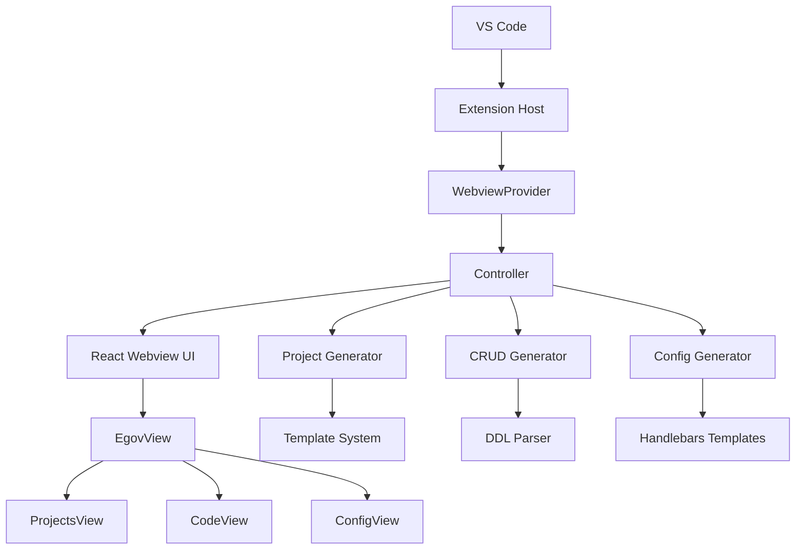

# eGovFrame Initializr - VS Code Extension

## 📋 프로젝트 개요

**eGovFrame Initializr**는 전자정부 표준프레임워크(eGovFrame) 프로젝트 생성 및 설정을 위한 Visual Studio Code 확장 프로그램입니다. 개발자가 eGovFrame 기반 프로젝트를 쉽고 빠르게 시작할 수 있도록 도와주는 통합 도구입니다.

### 주요 기능

- 🚀 **프로젝트 생성**: eGovFrame 템플릿 기반 프로젝트 자동 생성
- ⚙️ **설정 관리**: Spring Framework 설정 파일 (XML, Java Config, YAML, Properties) 생성
- 📝 **코드 생성**: DDL 기반 CRUD 코드 자동 생성
- 🎨 **통합 UI**: VS Code 내장 웹뷰 기반 사용자 인터페이스

## 🏗️ 아키텍처 구조

```
┌─────────────────────────────────────────────────────────────┐
│                    VS Code Extension                        │
├─────────────────────────────────────────────────────────────┤
│  Extension Host (Node.js)          │  Webview UI (React)    │
│  ├── extension.ts                  │  ├── App.tsx           │
│  ├── core/                         │  ├── components/       │
│  │   ├── webview/                  │  │   └── egov/         │
│  │   └── controller/               │  ├── context/          │
│  ├── utils/                        │  └── utils/            │
│  │   ├── egovProjectGenerator.ts   │                        │
│  │   ├── crudGenerator.ts          │                        │
│  │   └── configGenerator.ts        │                        │
│  └── services/                     │                        │
└─────────────────────────────────────────────────────────────┘
```

### 컴포넌트 상호작용



## 📁 폴더 구조

### 루트 구조
```
vscode-egovframe-initializr/
├── 📁 assets/              # 아이콘 및 리소스
├── 📁 src/                 # Extension 소스코드
├── 📁 webview-ui/          # React 웹뷰 UI
├── 📄 package.json         # Extension 메니페스트
├── 📄 esbuild.js          # Extension 빌드 설정
└── 📄 README.md           # 프로젝트 문서
```

### Extension 소스 (`src/`)

```
src/
├── 📄 extension.ts                 # Extension 진입점
├── 📁 core/
│   ├── 📁 webview/                # 웹뷰 라이프사이클 관리
│   │   └── 📄 index.ts            # WebviewProvider 클래스
│   └── 📁 controller/             # 웹뷰 메시지 처리 및 작업 관리
│       └── 📄 index.ts            # Controller 클래스
├── 📁 utils/                      # 핵심 생성 유틸리티
│   ├── 📄 egovProjectGenerator.ts # eGovFrame 프로젝트 생성
│   ├── 📄 crudGenerator.ts        # CRUD 코드 생성
│   ├── 📄 configGenerator.ts      # 설정 파일 생성
│   ├── 📄 ddlParser.ts           # DDL 파싱
│   └── 📄 codeGeneratorUtils.ts   # 공통 코드 생성 유틸
├── 📁 services/                   # 보조 서비스
│   └── 📁 glob/
│       └── 📄 list-files.ts       # 파일 목록 서비스
└── 📁 shared/                     # 공유 타입 및 유틸리티
    ├── 📄 api.ts
    ├── 📄 ExtensionMessage.ts
    └── 📄 WebviewMessage.ts
```

### Webview UI (`webview-ui/`)

```
webview-ui/
├── 📄 package.json             # React 앱 의존성
├── 📄 vite.config.ts           # Vite 빌드 설정
├── 📄 tailwind.config.js       # TailwindCSS 설정
└── 📁 src/
    ├── 📄 App.tsx              # 메인 React 앱
    ├── 📄 main.tsx             # React 진입점
    ├── 📁 components/
    │   └── 📁 egov/
    │       ├── 📄 EgovView.tsx         # 메인 탭 인터페이스
    │       ├── 📁 tabs/
    │       │   ├── 📄 ProjectsView.tsx  # 프로젝트 생성 탭
    │       │   ├── 📄 CodeView.tsx      # 코드 생성 탭
    │       │   └── 📄 ConfigView.tsx    # 설정 생성 탭
    │       ├── 📁 forms/               # 다양한 설정 폼들
    │       │   ├── 📄 DatasourceForm.tsx
    │       │   ├── 📄 CacheForm.tsx
    │       │   ├── 📄 LoggingForm.tsx
    │       │   └── 📄 ...
    │       └── 📁 templates/           # Handlebars 템플릿
    │           ├── 📄 templates-context-xml.json
    │           └── 📁 config/
    │               ├── 📁 datasource/
    │               ├── 📁 cache/
    │               ├── 📁 logging/
    │               ├── 📁 scheduling/
    │               └── 📁 ...
    ├── 📁 context/
    │   └── 📄 ExtensionStateContext.tsx
    └── 📁 utils/
        ├── 📄 templateUtils.ts
        ├── 📄 ddlParser.ts
        └── 📄 egovUtils.ts
```

## 🚀 주요 기능별 상세 설명

### 1. 프로젝트 생성 (Projects)

#### 기능 개요
- eGovFrame 표준 템플릿 기반 프로젝트 자동 생성
- Maven/Gradle 프로젝트 구조 지원
- 다양한 카테고리별 템플릿 제공

#### 구현 위치
- **UI**: `webview-ui/src/components/egov/tabs/ProjectsView.tsx`
- **로직**: `src/utils/egovProjectGenerator.ts`

#### 주요 타입
```typescript
interface EgovProjectConfig {
    projectName: string
    groupID: string
    outputPath: string
    template: EgovProjectTemplate
}

interface EgovProjectTemplate {
    displayName: string
    fileName: string
    pomFile?: string
}
```

#### 워크플로우
1. 사용자가 프로젝트 카테고리 선택 (Web, Mobile, Boot, MSA, Batch 등)
2. 해당 카테고리의 템플릿 목록 표시
3. 프로젝트명, Group ID, 출력 경로 입력
4. 템플릿 ZIP 파일 추출 및 프로젝트 구조 생성
5. Maven POM 파일 커스터마이징
6. VS Code에서 프로젝트 열기 옵션 제공

### 2. 코드 생성 (Code Generator)

#### 기능 개요
- DDL(Data Definition Language) 기반 CRUD 코드 자동 생성
- Controller, Service, DAO, VO 클래스 생성
- MyBatis XML 매핑 파일 생성

#### 구현 위치
- **UI**: `webview-ui/src/components/egov/tabs/CodeView.tsx`
- **로직**: `src/utils/crudGenerator.ts`, `src/utils/ddlParser.ts`

#### DDL 파싱
```typescript
interface TableInfo {
    tableName: string
    attributes: ColumnInfo[]
    pkAttributes: ColumnInfo[]
}

interface ColumnInfo {
    name: string
    type: string
    isNullable: boolean
    defaultValue?: string
    comment?: string
}
```

#### 생성되는 파일들
```
📁 {package}/
├── 📁 web/
│   └── 📄 {Entity}Controller.java     # REST API 컨트롤러
├── 📁 service/
│   ├── 📄 {Entity}Service.java        # 비즈니스 로직 인터페이스
│   └── 📁 impl/
│       └── 📄 {Entity}ServiceImpl.java # 서비스 구현체
├── 📁 service/
│   └── 📄 {Entity}DAO.java            # 데이터 액세스 객체
└── 📁 vo/
    └── 📄 {Entity}VO.java             # Value Object
📁 resources/
└── 📁 egovframework/mapper/
    └── 📄 {Entity}_SQL.xml            # MyBatis 매핑
```

### 3. 설정 생성 (Configuration)

#### 기능 개요
- Spring Framework 다양한 설정 파일 생성
- XML, Java Config, YAML, Properties 형식 지원
- 실시간 미리보기 및 폼 유효성 검증

#### 구현 위치
- **UI**: `webview-ui/src/components/egov/tabs/ConfigView.tsx`
- **폼들**: `webview-ui/src/components/egov/forms/`
- **로직**: `src/utils/configGenerator.ts`

#### 지원하는 설정 유형

| 카테고리 | 설정 유형 | 설명 |
|---------|----------|------|
| **Cache** | New Cache | 기본 캐시 설정 |
| | New Ehcache Configuration | Ehcache 설정 |
| **Datasource** | New Datasource | 데이터소스 설정 |
| | New JNDI Datasource | JNDI 데이터소스 |
| **Transaction** | Datasource Transaction | 데이터소스 기반 트랜잭션 |
| | JPA Transaction | JPA 트랜잭션 |
| | JTA Transaction | JTA 트랜잭션 |
| **ID Generation** | Sequence ID Generation | 시퀀스 기반 ID 생성 |
| | Table ID Generation | 테이블 기반 ID 생성 |
| | UUID Generation | UUID 생성 |
| **Logging** | Console Appender | 콘솔 로그 |
| | File Appender | 파일 로그 |
| | Rolling File Appender | 롤링 파일 로그 |
| | JDBC Appender | 데이터베이스 로그 |
| **Scheduling** | Bean Job | Bean 기반 작업 |
| | Method Job | 메소드 기반 작업 |
| | Simple Trigger | 단순 트리거 |
| | Cron Trigger | Cron 트리거 |

#### 템플릿 시스템
- **Handlebars** 템플릿 엔진 사용
- 다중 출력 형식 지원 (XML, Java, YAML, Properties)
- 조건부 렌더링 및 헬퍼 함수 지원

```handlebars
{{!-- Datasource XML 템플릿 예시 --}}
<bean id="{{txtDatasourceName}}" class="org.springframework.jdbc.datasource.DriverManagerDataSource">
    <property name="driverClassName" value="{{txtDriver}}" />
    <property name="url" value="{{txtUrl}}" />
    <property name="username" value="{{txtUser}}" />
    {{#if txtPasswd}}
    <property name="password" value="{{txtPasswd}}" />
    {{/if}}
</bean>
```

## 🔧 빌드 시스템

### Extension 빌드 (ESBuild)

**설정 파일**: `esbuild.js`

#### 주요 특징
- **번들링**: 모든 소스를 단일 `dist/extension.js` 파일로 번들
- **타입스크립트 컴파일**: 네이티브 TS 지원
- **경로 별칭**: `@core`, `@utils`, `@shared` 등 단축 경로
- **감시 모드**: 개발 중 자동 리빌드
- **WASM 파일 복사**: Tree-sitter 언어 파서용

#### 빌드 명령어
```bash
# 개발 빌드 + 감시
npm run watch

# 프로덕션 빌드
npm run package

# 타입 체크
npm run check-types

# 린팅
npm run lint
```

### Webview UI 빌드 (Vite)

**설정 파일**: `webview-ui/vite.config.ts`

#### 주요 특징
- **React + SWC**: 빠른 개발 서버 및 빌드
- **TailwindCSS**: 유틸리티 우선 CSS 프레임워크
- **HMR**: Hot Module Replacement로 빠른 개발
- **타입스크립트**: 완전한 타입 안정성
- **테스트**: Vitest + JSdom 환경

#### 빌드 명령어
```bash
# 개발 서버 시작
cd webview-ui && npm run dev

# 프로덕션 빌드
cd webview-ui && npm run build

# 테스트 실행
cd webview-ui && npm run test

# 테스트 커버리지
cd webview-ui && npm run test:coverage
```

## 🔄 개발 워크플로우

### 1. 초기 설정
```bash
# 프로젝트 클론
git clone <repository-url>
cd vscode-egovframe-initializr

# 전체 의존성 설치
npm run install:all
```

### 2. 개발 모드 실행
```bash
# Terminal 1: Extension 감시 빌드
npm run watch

# Terminal 2: Webview UI 개발 서버
npm run dev:webview
```

### 3. 디버깅 설정
VS Code에서 F5 키를 눌러 Extension Development Host 실행

**`.vscode/launch.json`** 설정이 필요한 경우:
```json
{
    "version": "0.2.0",
    "configurations": [
        {
            "name": "Run Extension",
            "type": "extensionHost",
            "request": "launch",
            "args": ["--extensionDevelopmentPath=${workspaceFolder}"],
            "outFiles": ["${workspaceFolder}/dist/**/*.js"],
            "preLaunchTask": "${workspaceFolder}/npm: compile"
        }
    ]
}
```

### 4. 테스트 실행
```bash
# Extension 테스트 (향후 추가 예정)
npm test

# Webview UI 테스트
cd webview-ui && npm run test
```

## 📦 배포 및 퍼블리싱

### 1. Extension 패키징
```bash
# VSIX 파일 생성
npm run package
vsce package

# 생성된 파일: egovframe-initializr-{version}.vsix
```

### 2. 마켓플레이스 배포
```bash
# VS Code 마켓플레이스 배포
vsce publish

# 특정 버전 배포
vsce publish 1.0.1
```

### 3. 배포 전 체크리스트
- [ ] 모든 테스트 통과
- [ ] 린팅 오류 없음
- [ ] `package.json` 버전 업데이트
- [ ] `CHANGELOG.md` 작성
- [ ] 프로덕션 빌드 테스트
- [ ] Extension Host에서 수동 테스트

## 🛠️ 기술 스택

### Backend (Extension Host)
- **런타임**: Node.js
- **언어**: TypeScript
- **빌드**: ESBuild
- **템플릿**: Handlebars
- **파일 처리**: fs-extra
- **압축**: archiver

### Frontend (Webview UI)
- **프레임워크**: React 18
- **언어**: TypeScript
- **빌드**: Vite
- **스타일링**: TailwindCSS + Styled Components
- **UI 키트**: @vscode/webview-ui-toolkit, @heroui/react
- **상태 관리**: React Context API
- **폼 처리**: React Hook Form (추후 도입 권장)
- **테스트**: Vitest + Testing Library

### 개발 도구
- **린터**: ESLint + TypeScript ESLint
- **포매터**: Prettier
- **타입 체킹**: TypeScript
- **커밋 훅**: Husky (설정 가능)

## 🔍 트러블슈팅

### 일반적인 문제들

#### 1. Extension이 활성화되지 않는 경우
```bash
# 빌드 상태 확인
npm run check-types
npm run compile

# VS Code 개발자 도구에서 오류 확인
Ctrl+Shift+I (또는 Cmd+Option+I)
```

#### 2. Webview가 로드되지 않는 경우
```bash
# Webview UI 빌드 확인
cd webview-ui
npm run build

# 개발 서버 포트 확인 (25463)
npm run dev
```

#### 3. 템플릿 생성 오류
- `egovframe-pack` 폴더의 템플릿 파일 존재 확인
- 출력 경로 권한 확인
- Handlebars 템플릿 문법 오류 검토

#### 4. CRUD 생성 실패
- DDL 문법 확인 (MySQL, PostgreSQL 등)
- 패키지명 유효성 검사
- 출력 폴더 접근 권한 확인

### 로그 확인 방법
```bash
# Extension 로그
VS Code > View > Output > eGovFrame Initializr

# Webview 로그  
VS Code > Help > Toggle Developer Tools > Console
```

## 📈 성능 최적화

### Extension 최적화
- **지연 로딩**: `activationEvents`를 `onStartupFinished`로 설정
- **번들 크기**: ESBuild로 최소화된 번들
- **메모리 관리**: Webview 인스턴스 적절한 해제

### Webview UI 최적화
- **코드 분할**: Vite의 동적 import 활용
- **리소스 최적화**: 이미지 및 폰트 최적화
- **메모이제이션**: React.memo, useMemo 적극 활용

## 🤝 기여 가이드

### 개발 참여 절차
1. **포크 및 클론**
   ```bash
   git clone https://github.com/your-username/vscode-egovframe-initializr.git
   ```

2. **브랜치 생성**
   ```bash
   git checkout -b feature/new-feature
   ```

3. **개발 및 테스트**
   ```bash
   npm run install:all
   npm run watch
   npm run dev:webview
   ```

4. **코드 품질 검사**
   ```bash
   npm run lint
   npm run format:fix
   npm run check-types
   ```

5. **풀 리퀘스트 생성**

### 코딩 컨벤션
- **TypeScript**: strict 모드 사용
- **네이밍**: camelCase (변수, 함수), PascalCase (클래스, 인터페이스)
- **파일명**: kebab-case 권장
- **커밋 메시지**: Conventional Commits 규칙 준수

### 새로운 템플릿 추가하기

1. **템플릿 파일 생성**
   ```
   webview-ui/src/components/egov/templates/config/{category}/{template}.hbs
   ```

2. **메타데이터 추가**
   ```json
   // templates-context-xml.json
   {
       "displayName": "Category > New Template",
       "templateFolder": "category",
       "templateFile": "template.hbs",
       "webView": "category-template-form.tsx",
       "fileNameProperty": "txtFileName",
       "javaConfigTemplate": "template-java.hbs",
       "yamlTemplate": "template-yaml.hbs",
       "propertiesTemplate": "template-properties.hbs"
   }
   ```

3. **폼 컴포넌트 생성**
   ```tsx
   // webview-ui/src/components/egov/forms/CategoryTemplateForm.tsx
   ```

## 📚 참고 자료

### 공식 문서
- [VS Code Extension API](https://code.visualstudio.com/api)
- [eGovFrame 공식 사이트](https://www.egovframe.go.kr)
- [Spring Framework 문서](https://spring.io/docs)

### 기술 문서
- [React 공식 문서](https://react.dev)
- [TypeScript 문서](https://www.typescriptlang.org/docs/)
- [Vite 문서](https://vitejs.dev)
- [TailwindCSS 문서](https://tailwindcss.com)
- [Handlebars 문서](https://handlebarsjs.com)

## 📝 라이선스

이 프로젝트는 Apache-2.0 라이선스 하에 배포됩니다. 자세한 내용은 [LICENSE](LICENSE) 파일을 참조하세요.

## 👥 개발팀

- **eGovFrame Center** - 주관 기관
- **개발자**: [기여자 목록](CONTRIBUTORS.md)

## 📞 지원 및 문의

- **이슈 트래킹**: [GitHub Issues](https://github.com/egovframework/egovframe-vscode-initializr/issues)
- **공식 홈페이지**: https://www.egovframe.go.kr
- **문서**: [Wiki 페이지](https://github.com/egovframework/egovframe-vscode-initializr/wiki)

---

이 README는 프로젝트 인계 및 신규 개발자 온보딩을 위한 종합 가이드입니다. 추가 질문이나 개선사항이 있으시면 이슈를 등록해 주세요.
