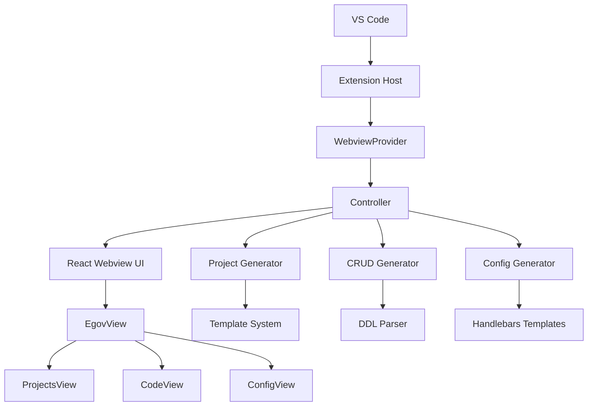

# Architecture Guide

## 개요

아키텍쳐 구조에 따른 컴포넌트간 상호작용과 전반적인 폴더 구조를 소개하는 문서입니다.

## 아키텍처 구조

```
┌──────────────────────────────────────────────────────────────────────────┐
│                            VS Code Extension                             │
├──────────────────────────────────────────────────────────────────────────┤
│  Extension Host (Node.js)          │  Webview UI (React)                 │
│  ├── extension.ts                  │  ├── App.tsx                        │
│  ├── core/                         │  ├── components/                    │
│  │   ├── webview/                  │  │   ├── egov/                      │
│  │   └── controller/               │  │   │   ├── tabs/                  │
│  ├── utils/                        │  │   │   │   ├── ProjectView.tsx    │
│  │   ├── projectGenerator.ts       │  │   │   │   ├── CodeView.tsx       │
│  │   ├── codeGenerator.ts          │  │   │   │   └── ConfigView.tsx     │
│  │   ├── configGenerator.ts        │  │   │   ├── forms/                 │
│  │   └── ...                       │  │   │   ├── CodePreview.tsx        │
│  ├── shared/                       │  │   │   ├── EgovSettingsView.tsx   │
│  │   ├── dataTypes.ts              │  │   │   ├── EgovView.tsx           │
│  │   ├── ExtensionMessage.ts       │  │   ├── ui/                        │
│  │   ├── WebviewMessage.ts         │  ├── context/                       │
│  │   └── ...                       │  ├── shared/                        │
│  └── services/                     │  └── utils/                         │
└──────────────────────────────────────────────────────────────────────────┘
```

### 컴포넌트 상호작용



## 폴더 구조

### 루트 구조
```
egovframe-vscode-initializr/
├── assets/              # 아이콘 및 리소스
├── src/                 # Extension 소스코드
├── webview-ui/          # React 웹뷰 UI
├── templates/           # 새로운 템플릿 루트 디렉토리
│   ├── projects/        # 프로젝트 템플릿
│   │   ├── examples/    # ZIP 템플릿 파일들 (Git LFS 관리)
│   │   └── pom/         # Maven POM 템플릿들
│   ├── config/          # Spring 설정 템플릿
│   └── code/            # CRUD 코드 템플릿
├── package.json         # Extension 메니페스트
├── esbuild.js           # Extension 빌드 설정
├── .gitattributes       # Git LFS 설정 파일
└── README.md            # 프로젝트 문서
```

> [!Important]
> **Git LFS 관리 파일**: `"*.zip"` 파일들은 모두 Git LFS로 관리됩니다. `"*.zip"` 파일들은 모두 `templates/projects/examples/` 폴더에만 존재합니다. 프로젝트 클론 전이라면 `git lfs install` 명령어를 실행 후 클론을 하면 됩니다. 프로젝트 클론을 먼저 했다면 `git lfs pull` 명령어로 다운로드하세요.

### Extension 소스 (`src/`)

```
src/
├── extension.ts                # Extension 진입점
├── core/
│   ├── webview/                # 웹뷰 라이프사이클 관리
│   │   └── index.ts            # WebviewProvider 클래스
│   └── controller/             # 웹뷰 메시지 처리 및 작업 관리
│       └── index.ts            # Controller 클래스
├── utils/                      # 핵심 생성 유틸리티
│   ├── projectGenerator.ts     # eGovFrame 프로젝트 생성
│   ├── codeGenerator.ts        # CRUD 코드 생성
│   ├── configGenerator.ts      # 설정 파일 생성
│   ├── ddlParser.ts            # DDL 파싱
│   ├── previewGenerator.ts     # 코드 미리보기 생성
│   └── codeGeneratorUtils.ts   # 공통 코드 생성 유틸
├── services/                   # 보조 서비스
│   └── glob/
│       └── list-files.ts       # 파일 목록 서비스
└── shared/                     # 공유 타입 및 유틸리티
    ├── api.ts
    ├── ExtensionMessage.ts
    └── WebviewMessage.ts
```

### Templates 디렉토리 (`templates/`)

```
templates/
├── templates-projects.json      # 프로젝트 템플릿 메타데이터
├── templates-context-xml.json   # 설정 템플릿 메타데이터
├── projects/                    # 프로젝트 템플릿
│   ├── examples/                # ZIP 템플릿 파일들
│   │   ├── egovframe-ai-rag-redis-stack.zip
│   │   ├── egovframe-boot-batch-db-commandline.zip
│   │   ├── egovframe-boot-simple-backend.zip
│   │   ├── egovframe-mobile-common-components.zip
│   │   ├── egovframe-msa-common-components.zip
│   │   ├── egovframe-template-common-components.zip
│   │   └── ... (총 21개 템플릿)
│   └── pom/                     # Maven POM 템플릿들
│       ├── egovframe-template-simple-pom.xml
│       ├── egovframe-boot-web-pom.xml
│       ├── egovframe-boot-simple-backend-pom.xml
│       └── ... (총 17개 POM 템플릿)
├── config/                      # Spring 설정 템플릿
│   ├── datasource/              # 데이터소스 설정
│   │   ├── datasource.hbs
│   │   ├── datasource-java.hbs
│   │   ├── jndiDatasource.hbs
│   │   └── jndiDatasource-java.hbs
│   ├── logging/                 # 로깅 설정 (21개 템플릿)
│   │   ├── console.hbs
│   │   ├── console-java.hbs
│   │   ├── console-yaml.hbs
│   │   ├── console-properties.hbs
│   │   ├── file.hbs
│   │   ├── rollingFile.hbs
│   │   └── ... (다양한 로깅 appender 템플릿)
│   ├── scheduling/              # 스케줄링 설정 (10개 템플릿)
│   │   ├── scheduler.hbs
│   │   ├── beanJob.hbs
│   │   ├── cronTrigger.hbs
│   │   └── simpleTrigger.hbs
│   ├── transaction/             # 트랜잭션 설정 (6개 템플릿)
│   │   ├── datasource.hbs
│   │   ├── jpa.hbs
│   │   └── jta.hbs
│   ├── idGeneration/            # ID 생성 설정 (6개 템플릿)
│   │   ├── xml-id-gnr-sequence-service.hbs
│   │   ├── xml-id-gnr-table-service.hbs
│   │   └── xml-id-gnr-uuid-service.hbs
│   └── property/                # 프로퍼티 설정 (2개 템플릿)
│       ├── property.hbs
│       └── property-java.hbs
└── code/                        # CRUD 코드 템플릿 (11개)
    ├── sample-controller-template.hbs
    ├── sample-service-template.hbs
    ├── sample-service-impl-template.hbs
    ├── sample-vo-template.hbs
    ├── sample-default-vo-template.hbs
    ├── sample-mapper-template.hbs
    ├── sample-mapper-interface-template.hbs
    ├── sample-jsp-list.hbs
    ├── sample-jsp-register.hbs
    ├── sample-thymeleaf-list.hbs
    └── sample-thymeleaf-register.hbs
```

> [!Note]
> **CRUD Code 템플릿 메타데이터**: CRUD Code 템플릿 메타데이터는 `src/utils/codeGenerator.ts`에 getTemplateFilesConfig 함수에서 관리됩니다.


### Webview UI (`webview-ui/`)

```
webview-ui/
├── package.json             # React 앱 의존성
├── vite.config.ts           # Vite 빌드 설정
├── tailwind.config.js       # TailwindCSS 설정 (VSCode 테마 통합)
└── src/
    ├── App.tsx              # 메인 React 앱
    ├── main.tsx             # React 진입점
    ├── components/
    │   ├── ui/                      # 커스텀 UI 컴포넌트 라이브러리
    │   │   ├── Button.tsx                # VSCode 스타일 버튼
    │   │   ├── Checkbox.tsx              # VSCode 스타일 체크박스
    │   │   ├── Divider.tsx               # VSCode 스타일 구분선
    │   │   ├── index.ts                  # 컴포넌트 라이브러리 엔트리포인트
    │   │   ├── Link.tsx                  # VSCode 스타일 링크
    │   │   ├── ProgressRing.tsx          # VSCode 스타일 프로그레스
    │   │   ├── RadioGroup.tsx            # VSCode 스타일 라디오 그룹
    │   │   ├── ResponsiveMenuButton.tsx  # VSCode 스타일 반응형 메뉴 버튼
    │   │   ├── Select.tsx                # VSCode 스타일 드롭다운
    │   │   ├── TextArea.tsx              # VSCode 스타일 텍스트 영역
    │   │   ├── TextField.tsx             # VSCode 스타일 입력 필드
    │   │   ├── theme.tsx                 # VSCode 스타일 테마 CSS 값
    │   │   └── VSCodeThemeProvider.tsx   # VSCode 테마 컨텍스트
    │   ├── egov/
    │   │   ├── EgovView.tsx         # 메인 탭 인터페이스
    │   │   ├── tabs/
    │   │   │   ├── ProjectsView.tsx  # 프로젝트 생성 탭
    │   │   │   ├── CodeView.tsx      # 코드 생성 탭 (네이티브 textarea)
    │   │   │   └── ConfigView.tsx    # 설정 생성 탭 (네이티브 select)
    │   │   ├── forms/               # 다양한 설정 폼들 (커스텀 컴포넌트 사용)
    │   │   │   ├── DatasourceForm.tsx
    │   │   │   ├── CacheForm.tsx
    │   │   │   ├── LoggingForm.tsx
    │   │   │   ├── TransactionForm.tsx
    │   │   │   ├── SchedulingForm.tsx
    │   │   │   └── ...
    │   │   ├── types/               # types 설정 인터페이스
    │   │   │   └── templates.ts     # ConfigFormData 인터페이스
    │   │   ├── CodePreview.tsx      # 코드 생성 탭 내 프리뷰 화면
    │   │   └── EgovSettingsView.tsx # Extension 설정 화면
    ├── context/
    │   ├── EgovTabsStateContext.tsx # egov 탭 상태 관리
    │   └── ExtensionStateContext.tsx # Extension 전반 상태 관리
    └── utils/
        ├── templateUtils.ts
        ├── ddlParser.ts
        ├── cn.ts                    # 클래스 네임 유틸리티
        ├── egovUtils.ts
        └── ...
```